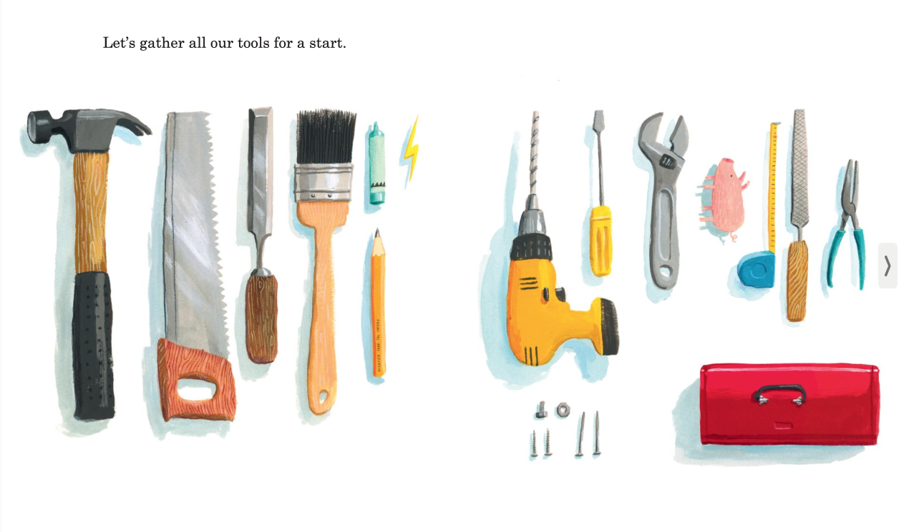

# localbest
localhost? No! localbest!

## "What shall we build, you and I?"

> – Oliver Jeffers, What We'll Build

As the proliferation of open source tools has continued over the last 20 years, management of my own local environment has grown unwieldy using my previous [dotfiles] setup.

The number of personal computers that I manage has grown considerably. When I wrote those dotfiles I was managing one laptop. Now I manage multiple home computers for my family, as well as a number of local NAS devices, and a small number of cloud-based instances. Each of which is currently a pet, not cattle.

Further, nearly every day for the last 16 years I've looked at what's new on Github. Often I find projects that I am interested in, but the overhead of attempting to install and leverage them is too great. This repository is my own exploration for how that day-to-day process could be improved. My own aim is to better internalize for myself what value could be gained from investing more or divesting in new or existing tools in the toolbox.

### Goals

- Quick bootstrap of new `darwin` or `alpine` envs with all of my personal preferences
- Lightweight tooling for easy Github cloning see: [ghcd], [gho]
- Tooling for a stage process (similar to TC-39) for my own usage of tools to build my own awareness of what tools I use the most vs what tools I'm experimenting with
- Continuously reproducible via Github Actions & [nix packages]

## Non-goals

- **No hotdog fingers** Attempting to be everything for everyone, everywhere, all at once always leads to [hotdog fingers]
- **Not (yet) another layer of abstraction** Contributions that attempt to make this universally generic will be rejected. Scripts or microtools that are included in this repository may graduate into their own projects, but fundmentally these endeavor is for my own computing needs first.

[dotfiles]: https://github.com/indexzero/dotfiles
[ghcd]: https://github.com/indexzero/dotfiles/blob/main/scripts/ghi
[hotdog fingers]: https://i.giphy.com/media/v1.Y2lkPTc5MGI3NjExNTYwcGVoc2RjOGRndDBvcHo5eDlna2w2bHA2NXpmNzdsanN1YmtlNyZlcD12MV9pbnRlcm5hbF9naWZfYnlfaWQmY3Q9Zw/WiCO2uZK05Klc1d28q/giphy.gif
[nix packages]: 
